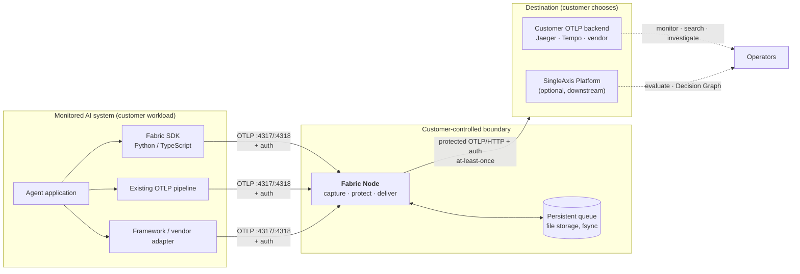
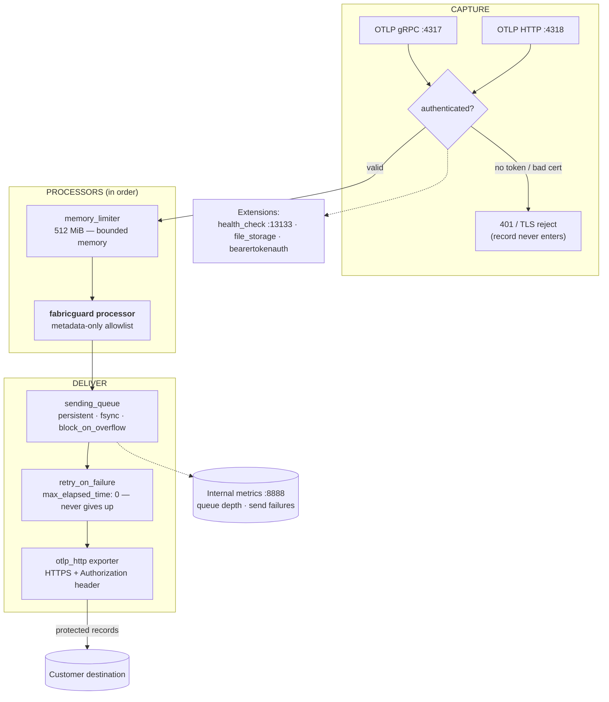
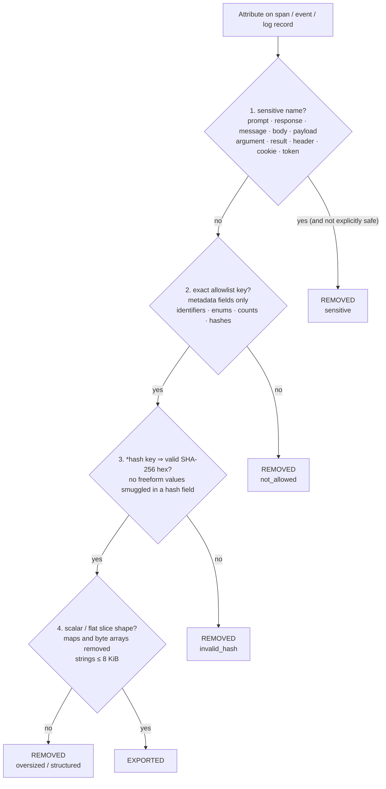
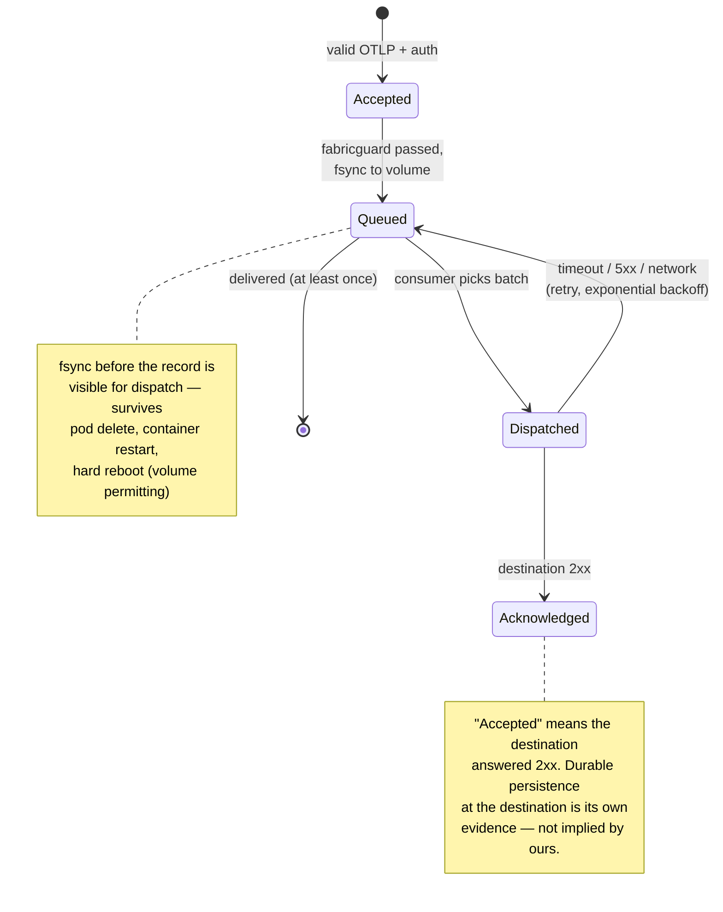
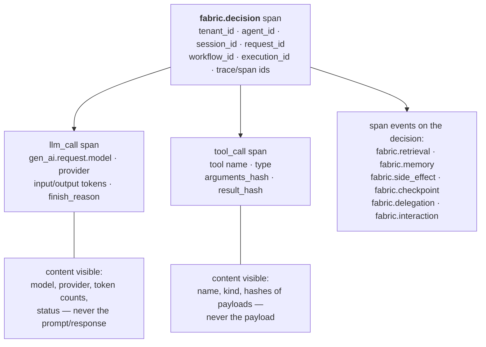
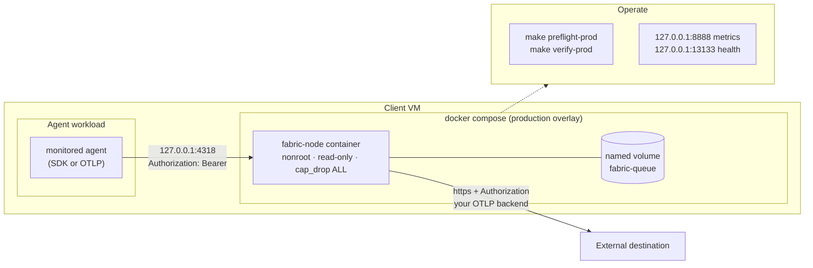
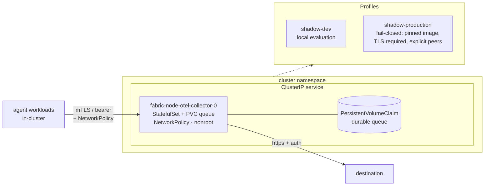

# Architecture

SingleAxis Fabric is a customer-controlled recording data plane for AI
systems. One deployable runtime — **Fabric Node** — performs the whole product
pipeline:

```text
CAPTURE -> PROTECT -> DELIVER
```

- **Capture** — accept OTLP telemetry from SDKs, adapters, or an existing
  collector over an authenticated listener.
- **Protect** — strip everything except an exact metadata allowlist before
  records cross the customer boundary.
- **Deliver** — buffer records in a persistent queue and retry export to the
  customer-chosen destination until it succeeds. At least once, never best
  effort.

The recorder is **passive**: it observes telemetry and must never block,
alter, or delay the monitored AI system. The accepted design of record is
[spec 027](../specs/027-recorder-v1.md).

## System context



Three boundaries matter:

1. **The monitored system is unaffected.** Telemetry flows one way; a Fabric
   Node outage cannot change an agent decision.
2. **Protection happens inside the customer boundary.** The allowlist runs in
   Fabric Node *before* export — not downstream, not "in transit".
3. **The destination is the customer's choice.** A private OTLP backend, a
   private SingleAxis deployment, or SingleAxis Platform — Fabric Node behaves
   identically toward each.

## Inside Fabric Node

Fabric Node is an OpenTelemetry Collector distribution with one job. The
pipeline is deliberately minimal — fewer stages, fewer failure modes:



Design notes:

- **No batch processor before the queue.** A volatile in-memory batch window
  in front of the durable queue would be a silent-loss mode; records are
  persisted per-request.
- **`block_on_overflow: true`.** A full queue back-pressures the receiver —
  the exporter blocks until space frees rather than the record silently
  dropping. This is the fail-safe choice for a recorder: backpressure is
  visible, loss is not.
- **`max_elapsed_time: 0s`.** Retry never expires. A destination outage
  pauses delivery; it does not delete data.
- **`memory_limiter` first.** The node sheds load on itself before it can be
  OOM-killed mid-batch.
- **Two pipelines only: `traces` and `logs`.** The image entrypoint
  (`fabric-gate`) refuses to boot a config defining any other pipeline, and
  the distribution-qualification test
  (`tests/qualify-distribution-config.sh`) proves the refusal, so new signal
  types cannot widen the export surface accidentally. `fabric-gate` also
  supervises bearer-token material while the collector runs — a mid-run
  rotation to an unsafe token file stops the recorder instead of minting an
  empty credential.

## How PROTECT decides what crosses the boundary

The allowlist applies to the shipped traces and logs pipelines; `fabric-gate`
enforces that pipeline set at container startup inside the image (bare-binary
builds rely on the qualification test).

The `fabricguard` processor applies a per-record, per-attribute decision
cascade. Every attribute key must survive all four gates:



Two more rules complete the gate:

- **Log record bodies and severity text are cleared.** Only allowlisted
  attributes and a normalized `event_name` survive — a log body is a free-form
  string channel and is always treated as content.
- **Event names are normalized to a fixed vocabulary** (`fabric.decision`,
  `fabric.llm_call`/`fabric.model_call`, `fabric.tool_call`,
  `fabric.retrieval`, `fabric.memory`, `fabric.side_effect`,
  `fabric.interaction`, `fabric.file_access`, `fabric.delegation`,
  `fabric.checkpoint`, `fabric.replay`, `fabric.mcp.inventory`,
  `fabric.skill`, `fabric.hook`, `fabric.coverage`, `fabric.error`,
  `fabric.retry`, `fabric.cancellation`, `fabric.execution`, …). Unknown
  names map to `fabric.activity` or are dropped when
  `drop_unknown_classes` is on — a caller-controlled event name can never
  smuggle text out.

The allowlist is **exact-key, not namespaced**. `fabric.*` as a prefix is not
trusted — every field the SDKs emit was reviewed and individually admitted
(identifiers, workflow/delegation structure, token counts, enums, hashes).
Caller-controlled free text — `fabric.tags`, `user_id`, raw paths, raw
targets, memory keys — stays denied. Removing denied keys is not the same as
guaranteeing no sensitive data exists in the remaining metadata; customers
still own classification and retention.

## Delivery lifecycle



What each state means operationally:

| State | Meaning | Who observes it |
|---|---|---|
| Accepted | Fabric Node returned 2xx to the agent | agent SDK |
| Queued | record fsynced to the node's volume | `otelcol_exporter_queue_size` |
| Dispatched | batch sent to destination | exporter logs |
| Acknowledged | destination answered 2xx | retry counter stops |
| Delivered | destination durably persisted | **destination's own evidence** |

Node restart: on boot, `file_storage` reloads the queue index and compacts —
undelivered records re-enter `Dispatched`. Destination outage: records
accumulate in the queue (bounded by `queue_size` items — size the volume for
the expected outage window) and drain when the destination returns.

Duplicate delivery is possible after ambiguous acknowledgements. Destinations
must deduplicate on the preserved `trace_id`/`span_id`/`event_id` — identity
is deliberately retained for exactly this reason.

## What arrives at the destination

A monitored workflow lands as a standard OTLP trace — existing backends
render it without any Fabric-specific tooling:



Cross-service agent workflows stay connected: SDK `inject()` writes W3C
`traceparent` plus Fabric identity into carriers, and the child decision
stamps `fabric.parent_agent_id` / `fabric.parent_decision_id`. A delegated
call chain reconstructs as one trace.

## Deployment topologies

### Single client VM (Docker, no Kubernetes)



Path: `deploy/compose/` — `make preflight-prod && make up-prod && make verify-prod`.
Ingress requires a bearer token (file secret); egress requires HTTPS + auth
header; receiver TLS is supported before binding beyond loopback.

### Kubernetes



Path: `helm install fabric charts/fabric -f charts/fabric/profiles/shadow-production.yaml`
plus the required secrets. The production profile fails closed on unpinned
images, missing TLS, and unbounded network peers.

## Components

| Component | What it is | What it is not |
|---|---|---|
| **Fabric SDKs** (Python, TypeScript) | Optional instrumentation emitting rich agentic-workflow telemetry (decisions, LLM/tool calls, retrieval, memory, side effects, delegation, checkpoints) | Required — any OTLP source works; richer source, richer record |
| **Fabric Node** | The recorder runtime: OTel Collector + `fabricguard` + durable queue | A relay, a proxy, or a control plane — no second hop, no agent control |
| **`fabricctl`** | Offline CLI: `init` (interactive wizard), `recorder validate`, `recorder digest` | A deploy tool — `init` writes a config + receipt marked `not-installed` |
| **Helm chart** | `charts/fabric` with `shadow-dev` / fail-closed `shadow-production` profiles | A management plane |
| **Compose overlay** | `deploy/compose` production path for a plain VM | An orchestration framework — Docker + restart policy is the whole story |
| **Contracts** | Public schemas: Activity Envelope v2, connect capability, privacy assertion, delivery evidence, recorder config | Runtime behavior — the envelope is the downstream normalization target, not what the node emits on the wire |

## What the recorder does not do

The release binary/chart/package surfaces contain no judges, red-team
runners, prompt-time PII engines, guardrails, policy enforcement, tool
authorization, or management UI — enforced by artifact-content tests, not
just disabled defaults. Blocking or altering agent traffic requires an
inline placement the passive recorder never occupies; that is a separate,
deliberate decision for later.

Downstream services (SingleAxis Platform, or any backend) consume the
protected record for monitoring, evaluation, and Decision Graph analysis.
They are consumers, not hidden dependencies — Fabric Node delivers a
verifiable record with or without them.
