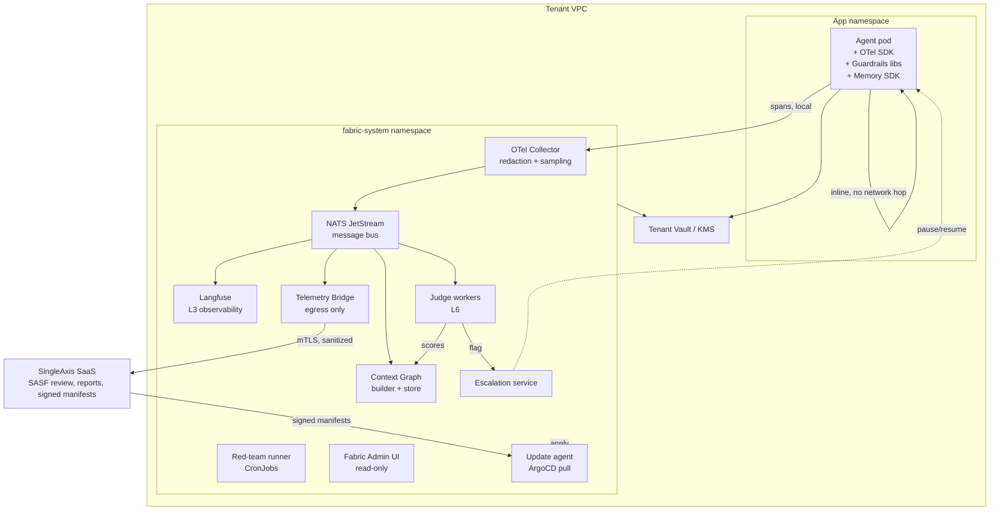

# 002 — Eight-Layer Architecture & Fabric Control Plane

## Summary

Fabric is organized as an eight-layer stack deployed into a single
Kubernetes namespace — `fabric-system` — inside the tenant's VPC. This
namespace is the **Fabric Control Plane**. The tenant's agent code runs
in its own namespace and interacts with the Control Plane through
in-process SDK calls (for latency-sensitive paths) and asynchronous
events (for everything else).

This spec defines the layers, their boundaries, which are inline vs
async, and how they compose into a deployable unit.

## Goals

1. Define each of the eight layers precisely, with tooling defaults
   and ownership (Fabric-provided vs tenant-chosen).
2. Specify the latency contract: inline components must not add
   measurable latency to the agent's critical path.
3. Define the Fabric Control Plane as the deployable unit — what runs
   in it, what doesn't, and how it integrates with tenant
   infrastructure.
4. Specify the eventing backbone (OTel Collector → message bus →
   consumers) that decouples the agent from downstream processing.

## Non-goals

- Prescribing an orchestration framework (see L1; tenant choice).
- Prescribing an LLM (tenant brings their own).
- Specifying implementation details of individual components (those
  live in component-specific specs and code).

## The eight layers

| # | Layer | Tenant chooses? | Default tooling | Latency tier |
|---|-------|-----------------|-----------------|--------------|
| L1 | Orchestration & Runtime | ✅ | LangGraph / CrewAI / Agent Framework / custom | Inline (tenant's agent) |
| L2 | Agent Tracing (OTel) | ⛔ standard | OpenTelemetry + GenAI semantic conventions | Inline (emit), async (export) |
| L3 | Observability & Eval Platform | ✅ (from menu) | Langfuse (also: Arize Phoenix, MLflow) | Async |
| L4 | Red-Teaming & Testing | ✅ (from menu) | Garak + PyRIT + Promptfoo | Offline (not in request path) |
| L5 | Guardrails & Policy | Opinionated default | Presidio + NeMo Guardrails | **Inline, in-process** |
| L6 | LLM-as-a-Judge | ✅ (from menu + SASF) | Ragas + DeepEval + SASF rubrics | Async (blocking only on escalation) |
| L7 | Security & Access Control | ✅ (tenant infra) | Integrates with tenant Vault / KMS / IAM | Inline (cached auth) |
| L8 | Context Sources | ✅ | pgvector / Qdrant / Neo4j / Mem0 — pluggable | Inline (read, cached), async (write) |

All eight converge into the **Context Graph** (see spec 003), which is
the unified per-decision artifact Fabric produces.

### L1 — Orchestration & Runtime

Tenant decision. Fabric provides SDK adapters for common frameworks
(LangGraph and Microsoft Agent Framework at launch; CrewAI as a
stretch) so that tracing, guardrails, memory read, and escalation
hooks integrate cleanly.

The adapter surface is small and documented so tenants using
less-common frameworks or homegrown orchestrators can conform.

### L2 — Agent Tracing (OTel)

Standard. OpenTelemetry, with the OpenTelemetry GenAI semantic
conventions (the `gen_ai.*` namespace, jointly stewarded by the
OTel community) used for LLM-call attributes alongside Fabric's
own `fabric.*` namespace for agent-decision-level governance
metadata. The conventions are still maturing; the SDK writes both
namespaces from v0.2.0 onward so dashboards keyed off either
namespace render correctly. The SDK emits from the tenant's agent
with no network hop; a local OTel Collector sidecar receives spans
and fans out to whatever observability backend the operator chose
(Langfuse, Phoenix, Datadog, Honeycomb, your own collector, or —
for partner deployments — the SingleAxis commercial Telemetry
Bridge). Span emission is fire-and-forget; agent never waits.

Earlier revisions of this spec named the conventions "OpenLLMetry"
(Traceloop's project name); the conventions are now joint
OTel/Traceloop work and the OTel naming is preferred. Fabric does
not depend on `traceloop-sdk`; auto-instrumentation packages
(`opentelemetry-instrumentation-openai`, etc.) are pulled as opt-in
extras only.

### L3 — Observability & Eval Platform

Tenant picks from a menu; Langfuse is the default. The chosen
platform receives a full-fidelity span stream via the OTel Collector.
Used by the tenant's team for debugging, cost tracking, and local
evaluation. **Runs entirely in-VPC.**

### L4 — Red-Teaming & Testing

Offline jobs, not in the request path. A `CronJob` runs Garak and
PyRIT suites on a schedule against the agent's endpoint. Results are
recorded in the Context Graph and exported via the Telemetry Bridge.

### L5 — Guardrails & Policy

**Inline and in-process.** Presidio (PII detection / redaction) and
NeMo Guardrails (content policy / dialog control) run as Python
libraries imported by the agent. No network call, no sidecar for the
inline path. Streaming output filter runs concurrently with token
generation.

Guardrails are the most latency-sensitive component. See spec 005.

### L6 — LLM-as-a-Judge

Async consumers. Judges subscribe to the event bus, pull the decision
node from the Context Graph, and score against a rubric. Scores are
written back to the Context Graph and, for flagged outputs, trigger
the escalation workflow (spec 007).

Judges run on the **tenant's own LLM endpoint** so that raw content
stays in-VPC.

### L7 — Security & Access Control

Integrates with tenant infrastructure. Fabric does not ship a secrets
manager or an IAM. It reads from the tenant's Vault / AWS Secrets
Manager / GCP Secret Manager / Azure Key Vault. Tool permissions for
the agent are declared in `values.yaml` and enforced by the SDK.

Agent identity is minted per-session; tool calls carry the identity
for downstream auth. Sandboxing (E2B Firecracker or similar) is
opt-in via profile.

### L8 — Context Sources

Not "memory + RAG" — more general. Includes:

| Source | Use |
|--------|-----|
| Working memory | State within one task execution |
| Episodic memory | Past sessions with the user |
| Semantic memory | Extracted facts |
| RAG corpus | Vector retrieval over documents |
| Knowledge graph | Structured entity/relationship retrieval |
| Tool outputs | API results passed into context |
| Document context | Files included in the prompt |

Fabric's contribution at L8 is not picking a vector DB. Its
contribution is the **governance layer**: per-user scoping,
right-to-be-forgotten cascade, PII-on-write detection, retrieval
audit into the Context Graph.

## Latency tiering

The architecture is shaped by one rule: **inline work must not add
measurable latency to the agent's critical path.**

| Tier | What runs here | Budget |
|------|----------------|--------|
| **Inline** | L5 guardrails (in-process), L7 auth (cached), L8 context read (cached embeddings), L2 span emit (fire-and-forget) | Total overhead < 200ms p99 |
| **Async** | L2 export, L3 ingest, L6 judges, L8 writes, Context Graph builder, Telemetry Bridge | No budget on agent path; workers catch up |
| **Offline** | L4 red-team, scheduled evals, report generation | Runs on CronJobs |

See spec 005 for the guardrails latency budget in detail.

## The Fabric Control Plane



## The message bus

**Choice: NATS JetStream.** Selected over Kafka and Redis Streams for:

- Single-binary deployment (low ops burden for tenants)
- Persistent streams with replay (needed for delayed judges and
  recovery)
- At-least-once delivery with consumer acknowledgment (correct
  semantics for judges)
- Lightweight enough for small deployments (< 100 MB memory idle)
- Horizontally scalable when needed (cluster mode)

Kafka is too heavy for the common case. Redis Streams is lighter but
lacks JetStream's consumer groups and message replay semantics we
need for judge workers.

Tenants with strong existing Kafka infrastructure may replace NATS
via `values.yaml` (supported alternate). See spec 008.

## Event flow — happy path

```
User turn arrives at agent
  └─> agent (L1) starts decision
      ├─> L5 input guardrail (inline, sync, < 150ms)
      ├─> L7 auth + permissions check (inline, sync, cached, < 20ms)
      ├─> L8 context read (inline, sync, cached, < 100ms)
      ├─> LLM call (tenant's model, streaming)
      │     └─> L5 output guardrail (streaming, concurrent)
      ├─> L2 span emit (inline, fire-and-forget, < 5ms)
      ├─> L8 context write (async enqueue, < 5ms)
      └─> response to user

  (in parallel, on the event bus:)
  L3 Langfuse ingests span → dashboards update
  Context Graph builder materializes node
  L6 Judge worker pulls decision → scores → writes back
  Telemetry Bridge enqueues sanitized summary → egress
```

The critical path is inline-only. Everything else happens on the bus,
concurrently.

## Event flow — flagged path

```
... L6 Judge worker scores decision
      └─> score below threshold OR policy violation detected
          └─> Escalation service receives flag
              ├─> agent checkpointed via LangGraph interrupt
              ├─> sanitized escalation packet to Telemetry Bridge
              ├─> SASF reviewer queue in SingleAxis SaaS
              ├─> reviewer decides: approve | reject | modify
              └─> signed decision webhook → Escalation service
                    └─> agent resumes from checkpoint OR rejects turn
```

Content stays in-VPC. Only the decision record crosses the boundary.
See spec 007 for detail.

## Trust boundaries

| Boundary | Trust relationship |
|----------|-------------------|
| Agent ↔ Fabric SDK | In-process. Same trust domain. |
| Fabric SDK ↔ Fabric Control Plane (same VPC, same namespace group) | Trusted; mTLS within the cluster optional but recommended |
| Fabric Control Plane ↔ Tenant Vault / KMS | Read-only for most components; audited |
| Telemetry Bridge ↔ SingleAxis SaaS | **Only sanctioned egress.** mTLS with mutual auth, envelope encryption |
| Update agent ↔ SingleAxis manifest repo | Tenant-initiated pull; signature verified before apply |
| SASF reviewer ↔ Escalation decisions | Decisions signed by reviewer identity; verified on resume |

The Telemetry Bridge is the single choke point to audit for data
exfiltration. Every byte leaving the VPC passes through it. See
spec 004.

## Operational properties

- **Stateless workers where possible.** Judge workers, graph builder,
  and the bridge are stateless; state lives in NATS (bus) and
  Postgres (graph).
- **Horizontal scaling on the bus.** Adding more judge workers or
  bridge workers scales linearly until Postgres is the bottleneck.
- **Failure isolation.** A failing judge does not block agent turns
  (asynchrony). A failing bridge backpressures but does not block
  agents; messages queue in NATS.
- **Upgrade safety.** Components deploy independently; no coordinated
  restart needed. Span schema is versioned (OTel conventions);
  consumers tolerate both old and new within a window.

## Security considerations

- **Agent never talks to SingleAxis directly.** All egress is
  mediated by the Telemetry Bridge.
- **No secrets in `values.yaml`.** Secrets read from tenant's secret
  manager at runtime.
- **RBAC in `fabric-system`.** Components run under distinct service
  accounts with least privilege. Network policies restrict east-west
  traffic.
- **Admission controls.** Recommended: Kyverno or OPA Gatekeeper to
  enforce `fabric-system` policies at install and runtime.

## Operational considerations

- **Resource footprint (target).** Small deployment: 4 vCPU, 8 GiB
  memory, 100 GiB persistent. Scales with agent throughput.
- **HA mode.** NATS 3-node cluster; Postgres with streaming
  replication; Langfuse and workers 2+ replicas. Profile:
  `profile.availability=ha`.
- **Backup.** Postgres WAL archival to tenant-owned object storage.
  NATS persistent streams backed by the same PV class.

## Open questions

- **Q1.** Is NATS the final choice, or should we allow Kafka as an
  equal citizen in the default chart? *Resolver: platform maintainer.
  Deadline: before 0.1.0.*
- **Q2.** Do we ship our own OTel Collector distribution with
  redaction processors baked in, or run upstream with a processor
  plugin? *Resolver: telemetry maintainer. Deadline: before 0.1.0.*
- **Q3.** Sidecar vs in-process guardrails — is there a class of
  client (non-Python agents) where a sidecar is required and worth
  the latency cost? *Resolver: SDK maintainer. Deadline: before
  0.2.0.*

## References

- Spec 003 — Context Graph
- Spec 004 — Telemetry Bridge
- Spec 005 — Inline guardrails
- Spec 006 — LLM-as-Judge
- Spec 007 — Escalation workflow
- Spec 008 — Deployment model
- [OpenTelemetry semantic conventions for GenAI](https://opentelemetry.io/docs/specs/semconv/gen-ai/)
- [NATS JetStream](https://docs.nats.io/nats-concepts/jetstream)
