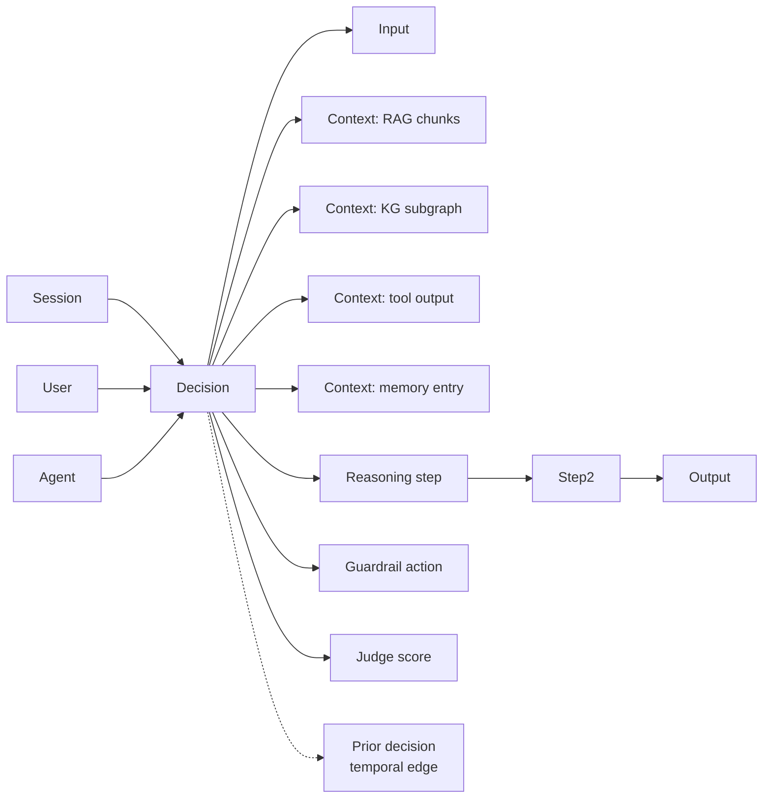
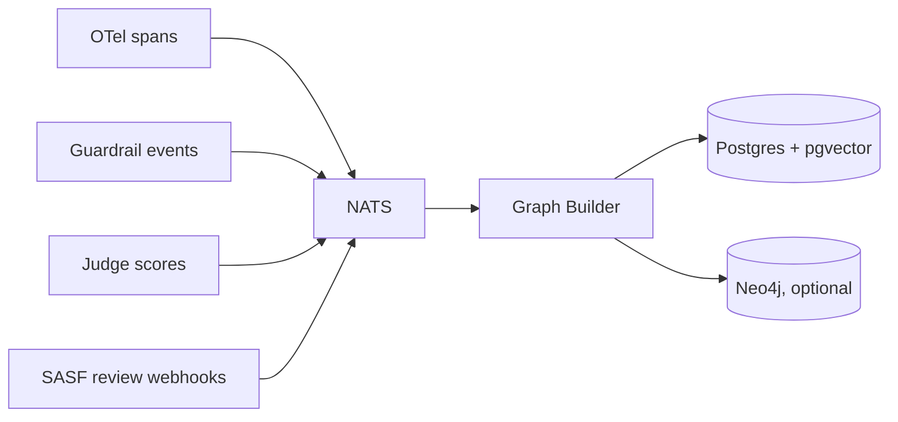

# 003 — Context Graph

## Summary

The **Context Graph** is Fabric's load-bearing contribution. It is a
unified, queryable artifact that captures **what the agent knew, what it
decided, and why**, for every decision the agent makes. It composes the
outputs of the other seven layers into a single graph per decision
(and a larger graph across all decisions for an agent, session, or
tenant).

For auditors and regulators, it is the evidence. For engineers, it is
the debugging and replay substrate. For L6 judges, it is the input.
For SASF reviewers, it is the review surface.

Context Graph is versioned, signed, and exportable. It is the first
thing Fabric produces that is net-new IP rather than integration
glue — and it is the artifact that makes the rest of Fabric
defensible under EU AI Act Article 13, NIST AI RMF "Measure" and
"Manage" functions, and ISO 42001 traceability requirements.

## Goals

1. Unify the four memory/context types (working, episodic, semantic,
   RAG/KG) with decision traces, tool calls, guardrail actions, and
   judge scores into a single graph per decision.
2. Provide a stable node/edge schema that downstream consumers
   (judges, SASF reviewers, evidence exporters) can rely on across
   Fabric versions.
3. Enable point-in-time reconstruction: for any decision, answer
   *"what did the agent see, what did it do, what was the outcome,
   and on what basis."*
4. Be storage-agnostic: the canonical storage is Postgres with
   pgvector; tenants that need richer graph queries can back with
   Neo4j. The schema is the same.
5. Support per-user deletion for right-to-be-forgotten.

## Non-goals

- Inferring the model's internal reasoning. We record what the agent
  *saw* and *did*, not what it "thought." See Security considerations.
- Being a general-purpose knowledge graph. The graph's shape is
  decision-centric.
- Long-term analytical data warehouse. For cross-agent analytics,
  tenants may export to their own warehouse.

## The shape

At the core, a Context Graph records a **Decision** node. A decision
is one agent turn that produces an observable output. Each decision
connects to:

- Its **inputs** (user input, session, tenant, agent identity)
- Its **retrieved context** (every source that fed the LLM)
- Its **reasoning steps** (tool calls, intermediate outputs)
- Its **guardrail actions** (redactions, blocks, policy triggers)
- Its **output** (final response, tool results returned)
- Its **judgements** (scores from L6 judges, reviews from SASF)
- Its **metadata** (model, cost, latency, trace ID)



## Node types

| Node type | Description | Key attributes |
|-----------|-------------|----------------|
| `Tenant` | The organization running Fabric | `id`, `name`, `region` |
| `Agent` | A logical agent / use case | `id`, `name`, `version`, `regulatory_profile` |
| `Session` | A user conversation or task | `id`, `user_id_hash`, `started_at`, `ended_at` |
| `User` | A pseudonymous user reference | `id_hash` (HMAC of tenant's user id) |
| `Decision` | One agent turn | `id`, `trace_id`, `timestamp`, `cost`, `latency_ms`, `model` |
| `Input` | What arrived | `content_hash`, `length`, `pii_detected` (bool), `redacted_content` |
| `Output` | What the agent said/did | `content_hash`, `length`, `pii_detected`, `redacted_content` |
| `Retrieval` | A context fetch | `source` (enum: `rag`, `kg`, `sql`, `tool`, `memory`, `document`), `query`, `result_hash`, `source_document_ids[]` |
| `Step` | A reasoning/tool step | `tool_name`, `args_hash`, `result_hash`, `timestamp` |
| `Guardrail` | A policy action | `layer` (`input`/`output`), `policy_id`, `action` (`redact`/`block`/`warn`), `entities_detected` |
| `Judge` | A judgement | `rubric_id`, `rubric_version`, `score`, `rationale_hash`, `judge_model`, `timestamp` |
| `Review` | A SASF human review | `reviewer_id`, `decision` (`approve`/`reject`/`modify`), `signed_at`, `signature` |
| `Escalation` | An escalation event | `id`, `trigger` (rubric id or policy), `status`, `opened_at`, `closed_at` |

### Content storage

**The graph does not store raw content by default.** It stores
**content hashes** and, if the tenant profile permits, a **redacted**
copy of the content. Raw content (if retained at all) lives in a
separate tenant-owned store referenced by the hash.

This matters because:

- The graph itself is what gets exported for evidence. It must be
  safe to export without additional redaction.
- Right-to-be-forgotten becomes a simple operation on the content
  store; graph nodes remain as structural evidence with hashes only.
- Judges and reviewers who need content access fetch it via a
  separate authenticated API, with each fetch recorded.

The content storage policy is selected per-profile (see
`specs/009-compliance-mapping.md`):

| Policy | Raw content stored? | Where | Retention |
|--------|--------------------|-------|-----------|
| `hash-only` | ❌ | n/a | n/a |
| `redacted` | ✅ (redacted) | tenant Postgres / S3 | per profile (default 90d) |
| `full` | ✅ (raw) | tenant Postgres / S3 | per profile (rarely advisable) |

## Edge types

| Edge | From → To | Semantic |
|------|-----------|----------|
| `produced_by` | Decision → Agent | Which agent produced this decision |
| `in_session` | Decision → Session | Session membership |
| `for_user` | Session → User | User association |
| `has_input` | Decision → Input | Decision's input |
| `has_output` | Decision → Output | Decision's output |
| `retrieved` | Decision → Retrieval | Context pulled for this decision |
| `stepped` | Decision → Step | Reasoning step taken (ordered) |
| `next_step` | Step → Step | Ordering within a decision |
| `triggered` | Decision → Guardrail | Guardrail action that fired |
| `judged_by` | Decision → Judge | Scoring applied |
| `reviewed_by` | Decision → Review | Human review attached |
| `escalated` | Decision → Escalation | Decision was escalated |
| `preceded_by` | Decision → Decision | Temporal edge within session |
| `referenced_entity` | Retrieval → Entity | KG-style entity reference |
| `resolved_by` | Escalation → Review | Which review closed the escalation |

All edges carry a timestamp and a Fabric version.

## Write path

Each downstream consumer writes through an idempotent, append-only
API. There is a single **Graph Builder** worker that consumes from the
message bus and materializes nodes/edges:



### Idempotency

Every write carries a `(decision_id, event_id)` pair. Duplicate events
(bus replays) are silently dropped. Events are processed in
`(timestamp, event_id)` order per decision; out-of-order arrivals
are buffered up to a configurable window (default 60s) and then
discarded with a warning.

### Schema migrations

Schema changes follow the rule: **new columns/tables are
additive-only; old consumers continue to read the old shape.** The
Graph Builder and readers advertise a `schema_version`; Fabric
releases specify a compatibility window (n-1).

Breaking schema changes require a new major Fabric version and a
documented migration path.

## Read path

Three read interfaces:

### 1. Decision-scoped read

`GET /graph/decisions/{id}` returns the full subgraph for one decision.
This is what judges, escalation workflows, and the evidence exporter
consume. Target latency: < 50ms p95 for hot decisions.

```json
{
  "decision_id": "...",
  "agent": { ... },
  "session": { ... },
  "user": { "id_hash": "..." },
  "input": { ... },
  "retrievals": [ { "source": "rag", ... }, ... ],
  "steps": [ ... ],
  "guardrails": [ ... ],
  "output": { ... },
  "judges": [ ... ],
  "reviews": [ ... ],
  "escalations": [ ... ],
  "metadata": { "model": "...", "cost_usd": 0.0031, "latency_ms": 1280 }
}
```

### 2. Cypher / GraphQL query

For complex queries ("show me all decisions in the last 7 days where
a judge flagged factuality below 0.7 and the RAG retrieval was from
the HR policy corpus") the read API exposes:

- **GraphQL** — the default and recommended interface, over the
  Postgres-backed schema.
- **Cypher** — available only when the optional Neo4j backing store
  is enabled.

### 3. Evidence export

`POST /graph/evidence/bundle` produces a **signed, schema-validated
evidence bundle** for a specified time range, regulatory profile, and
scope (agent / session / tenant). See
`specs/009-compliance-mapping.md` for the bundle schema.

## Storage design

### Default backend: Postgres + pgvector

- **Node tables:** one per node type; primary key is the node ID.
- **Edge table:** unified edge table with
  `(from_type, from_id, to_type, to_id, edge_type, timestamp, properties JSONB)`.
  Indexed on `(from_type, from_id, edge_type)` and
  `(to_type, to_id, edge_type)`.
- **Vector columns:** `pgvector` columns on `Retrieval` for query
  embeddings and on `Decision` for output embeddings (for similarity
  search during evidence export and cross-decision analytics).
- **Partitioning:** tables partitioned by `tenant_id` for multi-tenant
  deployments (rare — most tenants are single-tenant by design).
- **Retention:** TimescaleDB compression recommended for Decision and
  Step tables after 7 days; full retention drops per-profile.

Rationale: Postgres is ops-familiar, pgvector is sufficient for
Fabric's query needs, and partitioning is straightforward.

### Optional backend: Neo4j

For tenants that need richer graph traversal (multi-hop entity
reasoning, path-based explainability), Neo4j can be enabled as a
secondary store. The Graph Builder writes to both; the Cypher read
path uses Neo4j; the GraphQL and decision-scoped read paths use
Postgres. Both stores are kept consistent; Postgres is authoritative.

Neo4j is not the default because it adds ops burden and is not
needed for typical compliance queries.

## Separate OSS repository

Context Graph will be released as a **separate OSS repository** under
the SingleAxis GitHub organization (`singleaxis/context-graph`),
licensed Apache-2.0, consumed by Fabric as a dependency.

Reasons:

- Context Graph is independently useful; teams not using the full
  Fabric stack may adopt it for agent explainability alone.
- A narrower OSS surface attracts contributions and third-party
  tooling (visualizers, exporters).
- Keeps Fabric's dependency footprint explicit.

The two repos share maintainers initially.

## Compliance mapping

Context Graph directly satisfies the following regulatory
requirements. Full mapping in spec 009.

| Regulation | Article / Section | How the Graph satisfies it |
|------------|-------------------|-----------------------------|
| EU AI Act | Article 12 (Record-keeping) | Persistent, tamper-evident logs of system operation |
| EU AI Act | Article 13 (Transparency) | Decision-scoped reads expose inputs, logic, and context |
| EU AI Act | Article 14 (Human oversight) | Escalation + Review nodes evidence human-in-the-loop |
| EU AI Act | Article 15 (Accuracy, robustness) | Judge scores and red-team results attached to decisions |
| NIST AI RMF | Measure 2.8 — traceability | Full provenance per decision |
| NIST AI RMF | Manage 4.1 — documentation | Evidence bundle export |
| ISO 42001 | 8.3 — traceability | Content hashes + signed records |
| SR 11-7 | Model use and monitoring | Temporal edges + judge scores over time |
| HIPAA | Audit controls §164.312(b) | Authenticated access logs, immutable audit trail |
| GDPR | Article 17 — right to erasure | Per-user content deletion with preserved structural record |

## Security considerations

### Do not claim to read the model's mind

The graph records **inputs, retrieved context, tool outputs, and
final outputs**. It does not record LLM-generated "reasoning"
claims as ground truth. If the orchestrator exposes a chain-of-thought
string, store it as `Step.rationale_text` with a `generated: true`
flag — never as evidence of *why* the model decided.

This matters because LLM-generated rationales are demonstrably
unreliable. Overclaiming here would undermine Fabric's credibility
with exactly the auditors we're trying to win.

### Content hashing

Hashes are **HMAC-SHA-256** with a tenant-held key, not plain SHA-256.
Reasons:

- Prevents rainbow-table attacks on short or known contents (e.g.
  common greetings, boolean responses).
- Allows cross-decision correlation (same-content detection) without
  exposing content.
- The tenant controls the key; SingleAxis cannot correlate across
  tenants.

### PII in the graph

Graph nodes carry `pii_detected: bool` and a count of detected
entities (per category), but not the entities themselves. If the
profile enables redacted content storage, redacted strings are
stored; raw strings never appear in the graph itself.

### Multi-tenant isolation

In multi-tenant deployments (uncommon), all queries are scoped by
`tenant_id` at the database level via row-level security. Cross-
tenant queries are impossible without DB admin intervention, which
is logged.

### Deletion semantics

Right-to-be-forgotten (GDPR Article 17) is implemented as:

1. Remove all content rows for the user's `id_hash` from the content
   store.
2. Mark affected `Input` / `Output` / `Retrieval` nodes with
   `content_deleted: true`, preserving hashes for audit continuity.
3. Record a `DeletionEvent` node with timestamp and requester.
4. Optionally cascade to `Session` and downstream `Decision` metadata
   if the profile requires full erasure.

Structural evidence (that a decision occurred, that a guardrail fired,
that a review took place) is preserved; personal content is not.

## Operational considerations

- **Throughput.** Target 10k decisions/min per single-node deployment;
  horizontal scaling on bus consumers for higher loads.
- **Hot-path latency.** Decision-scoped read < 50ms p95 when the
  decision is within 24h. Older reads may hit cold partitions.
- **Storage growth.** Rule of thumb: ~5 KB per decision (graph only;
  content adds variable amounts). 10 M decisions = ~50 GB.
- **Backup.** Standard Postgres backup; incremental WAL archival.

## Open questions

- **Q1.** Default hash algorithm: HMAC-SHA-256 is the recommendation;
  is there a case for BLAKE3 for performance? *Resolver: graph
  maintainer. Deadline: before 0.1.0.*
- **Q2.** GraphQL vs OpenAPI/REST for the read API — GraphQL fits the
  graph shape but adds schema complexity. *Resolver: graph maintainer.
  Deadline: before 0.1.0.*
- **Q3.** Should the Graph Builder write a separate "audit log" row
  per edge insert, or is the edge timestamp sufficient? *Resolver:
  compliance advisor + graph maintainer. Deadline: before 0.2.0.*
- **Q4.** Visualization UI — build a minimal one, partner with
  Langfuse, or defer entirely? *Resolver: project lead. Deadline:
  before 0.2.0.*

## References

- Spec 002 — Architecture
- Spec 006 — LLM-as-Judge (consumer of the graph)
- Spec 009 — Compliance mapping (evidence bundle schema)
- [W3C PROV-DM](https://www.w3.org/TR/prov-dm/) — provenance data model prior art
- [OpenTelemetry semantic conventions for GenAI](https://opentelemetry.io/docs/specs/semconv/gen-ai/)
