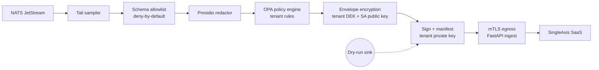

# 004 — Telemetry Bridge

> **Scope note (2026-04-27).** This spec is the **design of record**
> for the Telemetry Bridge, the egress component of the SingleAxis
> commercial control plane (Layer 2). The implementation lives in a
> separate private repository, not in this OSS distribution. The spec
> is retained here so partners and auditors can review the wire
> contract, redaction guarantees, envelope encryption, and signed
> manifest format that govern the egress path. L1 OSS deployments
> never run the Bridge; they emit OTLP to whatever observability
> backend the operator configures (Langfuse, Phoenix, Datadog, etc.).

## Summary

The **Telemetry Bridge** is the **only component in Fabric with egress
to SingleAxis SaaS**. It is the single choke point through which
sanitized, schema-validated, encrypted event summaries leave the tenant
VPC. Every byte that exits Fabric crosses this boundary.

The Bridge is opt-in. Tenants operating Fabric standalone (no SingleAxis
attestation) leave it disabled; nothing egresses. Tenants engaged with
SingleAxis enable it and configure which event classes to stream.

The design is shaped by one non-negotiable property: **no raw content,
no PII, no agent-generated text ever crosses the boundary.** Only
structured summaries — decision IDs, judge scores, rubric IDs, guardrail
counts, escalation references — egress.

## Goals

1. Provide the single auditable egress point for Fabric data.
2. Enforce a deny-by-default schema allowlist for egress payloads.
3. Run PII detection and redaction on every egressed field, with
   content-hash fingerprinting for cross-reference without exposure.
4. Encrypt payloads with envelope encryption (tenant-held data key,
   SingleAxis public key) so that neither party alone can read the
   payload history.
5. Provide a **dry-run mode** that shows what would be egressed,
   without actually egressing, for tenant security teams to audit
   before enabling.
6. Integrate seamlessly with the existing SingleAxis FastAPI backend.

## Non-goals

- Real-time streaming of agent content. The Bridge is summary-only.
- Being an observability SaaS. Langfuse (or chosen L3 tool) is the
  tenant's observability; the Bridge exists to feed SASF reviews and
  attestation.
- Client-side analytics. All analytics on Bridge data happens at
  SingleAxis.

## The pipeline



Each stage is a discrete processor. Stages are replaceable; policies
are tenant-configurable within the bounds of the schema allowlist.

## Stage specifications

### 1. Tail sampler

Not all events egress. The sampler applies a per-event-class policy:

| Event class | Default sample rate | Rationale |
|-------------|--------------------:|-----------|
| Decision summary | 10% | Statistical signal sufficient |
| Judge score | 100% if below threshold, 5% otherwise | Flagged decisions always reviewed |
| Escalation event | 100% | Must be actionable immediately |
| Red-team result | 100% | Infrequent, high signal |
| Guardrail action | 100% if blocked, 1% if warned | Block events matter |
| Cost / usage aggregate | 100% (already aggregated) | Tiny payloads |

Samples include a deterministic hash of `(tenant, decision_id)` to
make sampling reproducible and unbiased.

### 2. Schema allowlist

**This is the most important stage.** Every field in every outgoing
message must appear in the Bridge Schema. Fields not in the schema
are dropped, silently. The schema is:

- Versioned (compatible with SemVer)
- Published (part of the Fabric release)
- Validated in CI against every event producer
- Enforced at runtime with no escape hatch

An excerpt from the schema (the authoritative schema is maintained by
SingleAxis internally as part of the Telemetry Bridge service):

```python
# Excerpt — not normative here; the authoritative schema is Pydantic
# models shipped with the Bridge component.

class DecisionSummary(BaseModel):
    tenant_id: UUID                 # tenant hash, not name
    agent_id: UUID
    decision_id: UUID
    session_id_hash: str            # HMAC, not the raw session id
    user_id_hash: str
    timestamp: datetime
    model: Literal[...enum...]      # enumerated model names, no free-form
    cost_usd: float
    latency_ms: int
    input_length: int               # length only; no content
    output_length: int
    pii_detected_count: int         # count per category; no entities
    retrieval_count: int
    retrieval_sources: list[Literal["rag", "kg", "sql", "tool", "memory", "document"]]
    guardrail_actions: list[GuardrailSummary]  # summaries only
    judge_scores: list[JudgeSummary]
    schema_version: str
```

If an upstream event carries a field the schema does not allow, the
field is dropped. If every field is dropped, the event is dropped. The
tenant is notified (local log + Fabric Admin UI) when events are
dropped so misconfiguration is visible.

### 3. Presidio redactor

Even within allowed fields, strings that pass through must be scanned:

- **Pre-schema:** content summaries that include any string attribute
  (e.g. `rubric_id`, `agent_name`) pass through Presidio. If PII is
  detected despite being in an allowed field, the field is hashed
  (not redacted — the whole value is replaced) and a warning logged.
- **Categories:** Presidio's default recognizers plus tenant-
  configured custom recognizers (e.g. internal account number
  patterns). Configurable per profile.
- **Deterministic hashing:** when a value must be replaced, it is
  replaced with `HMAC-SHA-256(value, tenant_key)` — same input
  produces same output within a tenant, allowing cross-decision
  correlation at SingleAxis without exposing values. Different
  tenants produce different hashes (no cross-tenant correlation).

### 4. OPA policy engine

Tenants may add custom policies as OPA Rego bundles:

- Drop events matching a pattern
- Require additional redaction for specific fields
- Whitelist / blacklist agents, users, or source systems
- Rate limit egress per agent or globally

The policy engine runs after Presidio. Policies cannot **loosen** the
schema allowlist; they can only further restrict.

### 5. Envelope encryption

Payloads are encrypted with a **Data Encryption Key (DEK)** generated
per message. The DEK is then wrapped twice:

1. Wrapped with the tenant's KMS key (tenant retains control)
2. Wrapped with SingleAxis's public key (SingleAxis can unwrap if the
   tenant authorizes ingest)

To decrypt at SingleAxis, both wrapped DEKs are presented, and
decryption requires:

- SingleAxis's private key (held by SingleAxis)
- The tenant's authorization at the time of access (attested via
  tenant token or pre-authorized policy)

This provides a clear audit property: **SingleAxis cannot decrypt
historic Bridge payloads without the tenant's cooperation.** If the
tenant revokes authorization, the history becomes opaque.

### 6. Sign + manifest

Each outgoing message carries:

- A **signed manifest** of what was dropped (counts per redaction
  category, number of fields stripped, schema version, processor
  versions). The manifest is the **receipt**: the tenant can verify
  that redaction happened and that no side-channel occurred.
- The Bridge signs with the tenant's per-install identity (Ed25519
  key generated at Fabric install, stored in tenant Vault).
- SingleAxis verifies on receipt and stores the manifest alongside
  the payload.

### 7. mTLS egress

The final hop is mutual TLS over HTTPS:

- Client cert: Bridge, using the tenant's install certificate
- Server cert: SingleAxis ingest endpoint, pinned SPIFFE identity
  verified against the Fabric-shipped trust bundle
- No fallback to TLS without client auth

Egress endpoints are exactly one per SaaS region, named:
`https://ingest-<region>.singleaxis.com/v1/telemetry`. The tenant's
network allowlist permits only these. Adding any other egress
endpoint requires a new Fabric release (visible in the diff).

## Dry-run mode

Tenants SHOULD run the Bridge in dry-run for 2–4 weeks before enabling
real egress. Dry-run:

- Runs stages 1–6 fully
- Writes the final signed, encrypted payload to a **local** sink
  (tenant-owned S3 / Azure Blob / local PVC)
- Does **not** perform the egress
- Produces a daily summary of what would have been sent

Dry-run is enabled via `values.yaml`:

```yaml
telemetryBridge:
  enabled: true
  mode: dry-run          # or 'active'
  dryRunSink:
    type: s3
    bucket: my-tenant-fabric-dryrun
```

Switching from dry-run to active is a one-line config change and a
rolling restart. CISOs will often require dry-run review before
signing off.

## FastAPI ingestion endpoint (SingleAxis side)

The Bridge's counterpart is the FastAPI ingest endpoint on the
SingleAxis SaaS side. Contract:

```
POST /v1/telemetry/ingest
Headers:
  Content-Type: application/cbor   (or application/json; CBOR preferred for size)
  X-Fabric-Tenant-Id: <UUID>
  X-Fabric-Install-Id: <UUID>
  X-Fabric-Schema-Version: <SemVer>
  X-Fabric-Signature: <Ed25519 signature of body>
  X-Fabric-Manifest-Signature: <Ed25519 signature of manifest>
Body:
  {
    "envelope": { ... encrypted payload ... },
    "manifest": { ... dropped-fields receipt ... },
    "events": [ ... (encrypted within envelope) ... ]
  }
Response:
  202 Accepted (default)
  400 Bad Request — schema violation detected server-side
  401 Unauthorized — mTLS or signature invalid
  429 Too Many Requests — tenant quota exceeded
  503 Service Unavailable — backpressure; retry with backoff
```

Server-side processing (brief outline; details in SingleAxis SaaS
codebase, not this repo):

1. mTLS verification against tenant install registry
2. Signature verification (body + manifest) against tenant public key
3. Double-unwrap DEK (tenant-authorised + SingleAxis key)
4. Decrypt payload
5. Schema re-validation (defence in depth)
6. Persist to per-tenant partitioned table (Postgres) + S3 archive
7. Enqueue for SASF review pipeline

The ingest endpoint is built into the **existing SingleAxis FastAPI
backend** as a new route module. It reuses the existing tenant
registration, auth, and partitioned storage. Integration is small:

```
saas_backend/
├── app/
│   ├── routes/
│   │   └── v1/
│   │       └── telemetry.py        ← new
│   ├── services/
│   │   └── telemetry_ingest.py     ← new
│   ├── models/
│   │   └── telemetry_events.py     ← new (mirrors Fabric's Pydantic schema)
│   └── workers/
│       └── sasf_dispatcher.py      ← new, pushes to SASF review queue
```

The telemetry event models are **imported from the Fabric
`telemetry-bridge` Python package** to guarantee schema parity:

```python
# saas_backend/app/models/telemetry_events.py
from fabric_telemetry_bridge.schema import (
    DecisionSummary,
    JudgeSummary,
    GuardrailSummary,
    EscalationEvent,
)
```

This is the tie-in: the SingleAxis SaaS becomes a consumer of the
same schema Fabric publishes. Schema changes land in Fabric first;
SaaS pins to a Fabric version.

## Backpressure and reliability

- **Buffer:** NATS JetStream provides durable buffering. If the
  Bridge cannot reach SingleAxis, messages queue in NATS for up to
  7 days (configurable); agents are unaffected.
- **Retry:** exponential backoff with jitter, capped at 30 minutes
  per message. After cap, messages are moved to a dead-letter
  stream for tenant inspection.
- **Rate limiting:** the Bridge enforces a per-agent egress rate
  limit (default 100/s, configurable) to prevent runaway loops.
- **Circuit breaker:** if the SingleAxis endpoint is unreachable for
  30 min, the Bridge opens a circuit and emits a local alert
  (Prometheus metric + Admin UI banner). Agents continue; the queue
  backs up.

## Observability of the Bridge itself

The Bridge emits its own Prometheus metrics and OTel spans:

- `fabric_bridge_events_total{class, outcome}` — counter
- `fabric_bridge_dropped_total{reason}` — counter (schema, policy,
  redaction failure)
- `fabric_bridge_egress_duration_seconds` — histogram
- `fabric_bridge_queue_depth` — gauge
- `fabric_bridge_circuit_state` — 0/1/2 gauge (closed/open/half)

These go to the tenant's own Prometheus / monitoring stack. Nothing
about the Bridge's internal operation leaves the VPC.

## Security considerations

### Threat model

| Threat | Mitigation |
|--------|-----------|
| Malicious or misconfigured upstream emits PII in allowed fields | Presidio scan inside the Bridge; hashed replacement; manifest logs the replacement |
| Malicious component in `fabric-system` attempts direct egress | NetworkPolicy permits egress **only from the Bridge pod**; all other pods have egress denied |
| Compromised SingleAxis private key | Envelope double-wrap: tenant KMS key still required for decrypt |
| Compromised tenant install key | Tenant rotates via key-rotation endpoint; old keys revoked server-side |
| Replay attack | Each message carries a nonce + timestamp; server deduplicates |
| Schema evolution breaks contract | Schema version validated on send and receive; breaking changes require Fabric major version |
| Insider at SingleAxis attempts read without tenant auth | Tenant authorization check at decrypt time; decrypt events logged and visible to tenant |

### Defence in depth

Three independent checks ensure no content leaks:

1. **At the producer:** upstream components are written against the
   schema; CI validates that events conform.
2. **At the Bridge:** schema allowlist + Presidio + policy engine.
3. **At the egress:** the final signed manifest is re-checked on the
   SingleAxis side; payloads that fail server-side validation are
   rejected with 400 and an alert is raised both sides.

No single failure in any one layer results in content leaving.

### Key management

- **Tenant install key (Ed25519):** generated at install; stored in
  tenant Vault; used to sign payloads and manifests.
- **Tenant data key:** generated per-message; wrapped with tenant KMS
  key.
- **Tenant KMS key:** tenant-owned, tenant-managed. Fabric only
  references via ARN / URI.
- **SingleAxis public key:** shipped with Fabric; rotated via signed
  manifest update (ArgoCD pull).
- **SingleAxis SaaS endpoint certificate:** SPIFFE-based; pinned in
  Fabric trust bundle.

Key rotation procedures are maintained by SingleAxis internally
and shared with operators of the Telemetry Bridge under separate
documentation.

## Operational considerations

- **Latency:** Bridge processing adds ~5ms p95 per event (in-VPC
  hop). Egress latency depends on tenant ↔ SingleAxis region; 50–
  500ms typical.
- **Throughput:** target 10k events/min per Bridge pod; horizontal
  scaling via NATS consumer groups.
- **Disk:** dry-run sink grows with traffic; rotate and archive
  per tenant policy.
- **Upgrades:** Bridge is deployed as a standard Kubernetes
  Deployment; rolling upgrades are zero-downtime because
  JetStream consumers resume from last-ack.

## Open questions

- **Q1.** Is CBOR the right wire format, or should we stay on JSON
  for tooling simplicity? *Resolver: Bridge maintainer. Deadline:
  before 0.1.0.*
- **Q2.** Should we provide a "community ingest" endpoint for OSS
  users who want to run their own analogue of the SaaS ingest (for
  transparency / testing)? *Resolver: project lead. Deadline:
  before 0.2.0.*
- ~~**Q3.** What is the policy when a schema-allowlisted field
  unexpectedly exceeds a size bound?~~ **Resolved in Appendix A.4:
  drop the field, keep the event, record the drop in the manifest.**

## References

- Spec 002 — Architecture
- Spec 003 — Context Graph (the source of Bridge events)
- Spec 007 — Escalation workflow (the other user of Bridge egress)
- [OWASP Top 10 for LLM Applications](https://owasp.org/www-project-top-10-for-large-language-model-applications/)
- [SPIFFE / SPIRE](https://spiffe.io/) for workload identity
- [Envelope encryption — NIST SP 800-57](https://csrc.nist.gov/publications/detail/sp/800-57-part-1/rev-5/final)

## Appendix A — Wire contracts (normative)

These are the on-the-wire contracts the Python schema package
(`fabric_telemetry_bridge`) and the Go pipeline must both honour. Any
change here is a schema-version bump.

### A.1 Envelope

The egress body is a single CBOR or JSON object (CBOR preferred on
wire; JSON permitted for debugging and dry-run sinks):

```json
{
  "schema_version": "1.0.0",
  "tenant_id": "<UUID>",
  "install_id": "<UUID>",
  "batch_id": "<UUID v7, time-ordered>",
  "created_at": "<RFC3339 UTC>",
  "nonce": "<base64url, 16 bytes, unique per batch>",
  "event_count": 42,
  "dek_wrapped_tenant": "<base64url AES-GCM ciphertext of DEK, tenant KMS>",
  "dek_wrapped_singleaxis": "<base64url RSA-OAEP or ECIES of DEK, SA public key>",
  "payload": "<base64url AES-256-GCM ciphertext of CBOR-encoded events[] + IV + tag>",
  "manifest": { ... see A.2 ... }
}
```

Integrity:

- Batch integrity is provided by the AES-GCM tag on `payload`.
- Authenticity is provided by `X-Fabric-Signature` — an Ed25519
  signature over the canonical CBOR serialization of the envelope
  **excluding** the `X-Fabric-*` headers themselves.
- `X-Fabric-Manifest-Signature` separately signs the manifest, so a
  tenant can verify the receipt independently of the payload.

### A.2 Manifest (the receipt)

The manifest is what makes the Bridge auditable. It never contains
content, only counts:

```json
{
  "schema_version": "1.0.0",
  "processor_versions": {
    "bridge": "0.1.0",
    "presidio": "2.2.x",
    "opa": "0.68.x"
  },
  "input_event_count": 57,
  "output_event_count": 42,
  "dropped_events": {
    "schema_violation": 5,
    "policy_deny":       3,
    "redaction_failure": 0,
    "oversized_field":   7
  },
  "per_field_redactions": {
    "decision_summary.rubric_id": { "hashed": 2, "pii_category": ["PERSON"] },
    "judge_summary.note":         { "hashed": 1, "pii_category": ["EMAIL_ADDRESS"] }
  },
  "policy_bundle_digest": "<sha256 of active OPA bundle>",
  "sampler_seed": "<first 8 bytes of HMAC(tenant_id, batch_id)>",
  "generated_at": "<RFC3339 UTC>"
}
```

### A.3 Headers (normative)

```
Content-Type:                application/cbor  (or application/json in dry-run)
X-Fabric-Tenant-Id:          <UUID>
X-Fabric-Install-Id:         <UUID>
X-Fabric-Schema-Version:     <SemVer>
X-Fabric-Bridge-Version:     <SemVer>
X-Fabric-Signature:          <base64url Ed25519 signature of canonical envelope>
X-Fabric-Manifest-Signature: <base64url Ed25519 signature of manifest subtree>
X-Fabric-Nonce:              <base64url, matches envelope.nonce; replay window>
```

Servers MUST reject any request missing a required header with `401
Unauthorized`. Servers MUST enforce a replay window (default: reject
nonces seen in the last 24h).

### A.4 Oversized-field policy (resolves Q3)

If any schema-allowlisted field exceeds its declared size bound
(`max_length` in the Pydantic model):

1. The **field** is dropped from the event (not the whole event).
2. The drop is counted under `dropped_events.oversized_field`.
3. The per-field redaction map records `{ "<path>": { "oversized": N } }`.

The event still egresses with the field absent. This keeps partial
signal flowing without risking that an abnormally large value was a
content leak.

### A.5 Canonical serialization

For signatures and hashes, CBOR deterministic encoding
([RFC 8949 §4.2.1](https://www.rfc-editor.org/rfc/rfc8949#section-4.2.1))
is used. JSON signatures use JCS
([RFC 8785](https://www.rfc-editor.org/rfc/rfc8785)). Both the
producer and the verifier MUST use the same canonical form; mixing
forms is a schema-version break.
