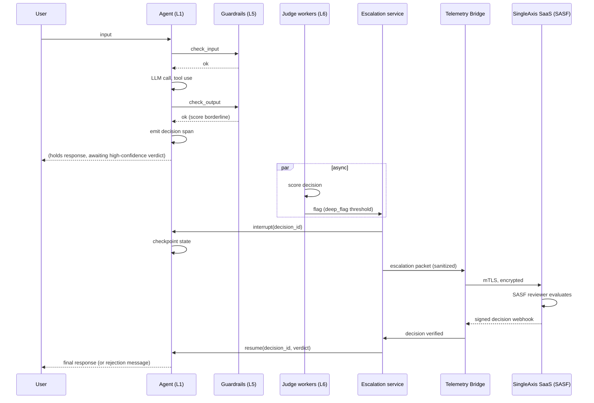

# 007 — Escalation Workflow

> **Scope split (2026-04-27).** This spec covers two layers that ship
> in different tiers:
>
> - **L1 OSS — Escalation primitive (this repo).** The SDK exception
>   (`EscalationRequested`), the typed payload (`EscalationSummary`),
>   `Decision.request_escalation`, and the orchestration adapters
>   (LangGraph `interrupt()`, MAF `request_info`, CrewAI
>   `human_feedback`) all ship in `sdk/python/`. Operators get a
>   clean way to pause the agent and emit an escalation event on the
>   decision span; what consumes that event is up to them.
>
> - **L2 commercial — SASF Review service + signed verdict + resume
>   protocol.** The reviewer dashboard, signed decision webhook, and
>   durable checkpoint store live in the SingleAxis commercial control
>   plane (separate private repository). Sections "SASF Review",
>   "Signed decision webhook", and "Resume protocol" below describe
>   that L2 pipeline as design of record; they are not implemented in
>   the OSS distribution.

## Summary

When a judge (L6) flags a decision as high-risk or a guardrail (L5)
escalates a borderline case, Fabric can **pause the agent mid-
execution**, hand the decision to a SASF human reviewer, and
**resume** (or reject) based on the reviewer's signed decision. This
spec defines the mechanics: how the agent pauses (L1 OSS), what
sanitized packet reaches the reviewer (L2), how the decision is
signed and returned (L2), and how the agent resumes without losing
state (L1 SDK + L2 backend).

Content stays in the tenant VPC. Only the decision — approve, reject,
modify — crosses the boundary to and from SASF.

## Goals

1. Integrate with LangGraph's checkpoint/interrupt primitives and
   Agent Framework's equivalent, rather than invent a new pause
   protocol.
2. Ensure the pause is durable — the agent process can restart and
   resume from the last checkpoint.
3. Define the sanitized packet format sent to SASF for review.
4. Define the signed-decision webhook that resumes the agent.
5. Specify timeouts, fallback policies, and operational safety.
6. Preserve end-user experience — if the workflow requires human
   review, the user is shown an appropriate message, not a silent
   hang.

## Non-goals

- Replacing Layer 5 blocking. If a decision must be blocked before
  reaching the user, that is a guardrail concern (spec 005).
- Supporting arbitrary approval workflows. SASF is the reviewer
  persona; tenant-internal approvers (manager review, legal signoff)
  are a separable future spec.
- Providing the review UI — that lives in the SingleAxis SaaS
  codebase, not in Fabric.

## The pause mechanism

LangGraph provides `interrupt()` and a checkpointer; Agent Framework
provides equivalent pause/resume with durable state. Fabric does not
build a pause protocol; it binds to these.



### Decision points

A decision is eligible for escalation when one of:

- A deep-tier judge produces a score below the rubric's `deep_flag`
  threshold
- A rubric marked `escalate_always: true` produces any result
- A guardrail action is `warn` on a category the profile marks
  as requiring human review (rare; most guardrail events are
  handled inline)
- An operator manually flags the decision via the Admin UI

Which events trigger escalation is profile-configured. The default
EU AI Act high-risk profile escalates on:

- Any deep-flagged factuality score
- Any deep-flagged bias score
- All tool calls that fail tool-safety judgement
- All guardrail warns in medical / legal / financial categories

## The escalation packet

What the SASF reviewer sees is a **sanitized copy of the decision
subgraph** plus a **redacted content view**. It does NOT include
PII entities, user identifiers (except user_id_hash), or session
secrets. It DOES include enough context for the reviewer to judge
whether the agent's action was appropriate.

```python
class EscalationPacket(BaseModel):
    escalation_id: UUID
    tenant_id: UUID
    agent_id: UUID
    agent_name: str
    agent_use_case_description: str         # static metadata, shipped with agent
    regulatory_profile: str

    decision_id: UUID
    decision_timestamp: datetime

    # Redacted content (PII replaced with typed placeholders)
    input_redacted: str
    output_redacted: str
    retrievals: list[RetrievalRedacted]
    steps: list[StepRedacted]

    # Judge context
    triggering_rubric_id: str
    triggering_rubric_version: str
    triggering_score: float
    all_judge_scores: list[JudgeSummary]

    # Guardrail context
    guardrail_events: list[GuardrailEventSummary]

    # User context
    user_id_hash: str
    session_id_hash: str
    session_turn_number: int

    # Review instructions (from the rubric)
    review_questions: list[str]             # rubric-provided guiding questions
    expected_response_time: str             # profile SLA, e.g. "4h"

    schema_version: str
```

**Redaction is performed by the Telemetry Bridge pipeline** (spec 004)
before egress. The SASF reviewer never sees raw PII. The reviewer can
request **full content** via an authenticated content-fetch call; such
fetches are:

- Permitted only by reviewers with the correct clearance for the
  tenant's profile
- Logged as a `ContentFetch` event attached to the escalation
- Rate-limited per reviewer
- Visible to the tenant via the Admin UI

This is the escape hatch for cases where redacted content is
insufficient to review. It is deliberately high-friction.

## The signed-decision webhook

Once the reviewer completes the review, SASF returns a signed
decision:

```python
class ReviewDecision(BaseModel):
    escalation_id: UUID
    decision_id: UUID

    verdict: Literal["approve", "reject", "modify"]
    rationale_redacted: str           # reviewer's reasoning, text
    reviewer_id: UUID                 # opaque, not PII
    reviewer_role: str                # e.g. "sasf.l2_safety"
    reviewed_at: datetime

    # For "modify"
    modified_output: Optional[str]    # replacement output if modifying
    modified_action: Optional[dict]   # e.g. "tool_call_denied": "send_email"

    # Signing
    signature: str                    # Ed25519 signature over the packet
    signing_key_id: str               # SingleAxis signing key identifier
```

The webhook posts to the Escalation service. The service:

1. Verifies the signature against the pinned SingleAxis signing key
2. Verifies the `escalation_id` matches an open escalation
3. Verifies the `reviewer_role` is sufficient for the triggering
   rubric's required clearance
4. Resumes the LangGraph checkpoint with the verdict

### Verdicts

| Verdict | Agent behaviour |
|---------|-----------------|
| **approve** | Resume with original output |
| **reject** | Resume with a policy rejection message; user sees "This request cannot be completed" (or profile-configured text) |
| **modify** | Resume with reviewer-supplied output in place of the agent's |

All three outcomes are logged as a `Review` node on the Context
Graph, edged to the escalation and the decision.

## User-facing behaviour during pause

The user must not be left hanging silently. Three modes:

1. **Synchronous review** (fast SLA, < 2 minutes) — the user's turn
   holds, with a visible "reviewing" indicator; response resumes
   when the verdict arrives.
2. **Asynchronous review** (4h–24h SLA) — the agent responds
   immediately with a profile-configured message ("Your request is
   under review and a response will be sent when approved").
   Resumption delivers the response through a side channel
   (email, webhook, ticket) that the tenant configures.
3. **Deferred action** (specific to actions, not responses) — the
   agent tells the user "this action requires approval"; approval
   is tracked as a separate ticket visible in the tenant's
   workflow tool.

The mode is per-profile; high-risk profiles default to async.

## Timeouts and fallback

Every escalation carries a **review deadline** from the profile. If
the deadline passes without a verdict:

| Fallback policy | Behaviour |
|-----------------|-----------|
| `fail-closed` (default) | Treat as `reject`; user sees rejection |
| `defer` | Send a neutral message, leave the escalation open for later retrieval |
| `fail-open` (rare, for non-safety-critical) | Treat as `approve` |

Fallback decisions are logged identically to normal reviews, with
`reviewer_id = "system.timeout"` and the policy recorded. They do
not carry the same attestation weight as a human review.

## Idempotency and duplicate delivery

- Webhook deliveries carry a request nonce; the Escalation service
  deduplicates on nonce.
- If the same `escalation_id` receives two different verdicts, the
  service **rejects the second** and emits an alert. This is a
  protocol violation and should never occur.
- If the agent's checkpoint cannot be resumed (process restarted,
  state lost), the service retrieves from the durable LangGraph
  checkpointer (Postgres-backed) and replays.

## Security considerations

- **Reviewer impersonation.** Prevented by Ed25519 signatures with
  SingleAxis-controlled keys. The pinning is part of the Fabric
  release; a key rotation ships as a Fabric minor release so
  tenants can review the diff.
- **Packet tampering in-flight.** mTLS with mutual auth plus
  envelope encryption (same as Telemetry Bridge).
- **Content refetch abuse.** Rate-limited, logged, visible to
  tenant. A reviewer fetching content beyond a profile-defined
  threshold triggers a tenant alert automatically.
- **Stale verdicts.** Verdicts carry a `reviewed_at` timestamp;
  the Escalation service rejects verdicts more than 7 days old
  (configurable) as stale.
- **Resume replay.** A resume event with a verdict for an already-
  resumed escalation is silently dropped; idempotency is enforced
  at the service layer.

## Operational considerations

- **Checkpoint storage.** Postgres-backed LangGraph checkpointer is
  the default; Redis backing is documented for low-persistence
  profiles. Checkpoint data counts toward tenant retention.
- **Queue depth.** SASF review queue depth is SingleAxis-side; the
  tenant sees a `pending_escalations` gauge in the Admin UI.
- **Reviewer capacity.** This is SingleAxis's operational constraint,
  not Fabric's. Fabric exposes the expected SLA per profile; SASF
  is responsible for meeting it. See `specs/001-product-vision.md`
  for the commercial dimension of reviewer throughput.
- **Escalation volume.** Typical steady-state: 0.1–1% of decisions
  escalate. A runaway rate (>5%) suggests profile misconfiguration;
  the Admin UI surfaces escalation rate with a default alert.

## Open questions

- **Q1.** Support tenant-internal reviewers (manager, legal, risk)
  as a parallel reviewer pool alongside SASF, in a future spec?
  *Resolver: project lead. Deadline: 0.3.0 scope.*
- **Q2.** Is checkpoint-in-Postgres sufficient for tenants running
  agents at >10k concurrent sessions, or do we need a dedicated
  state store? *Resolver: platform maintainer. Deadline: before
  0.2.0.*
- **Q3.** For "modify" verdicts, what is the audit story if the
  reviewer's replacement output itself needs review? Currently
  modifications are not re-scored. *Resolver: SASF + graph
  maintainers. Deadline: before 0.2.0.*

## References

- Spec 002 — Architecture
- Spec 003 — Context Graph
- Spec 004 — Telemetry Bridge
- Spec 006 — LLM-as-Judge
- [LangGraph human-in-the-loop](https://langchain-ai.github.io/langgraph/how-tos/human_in_the_loop/)
- [Microsoft Agent Framework — pause/resume](https://learn.microsoft.com/en-us/agent-framework/)
